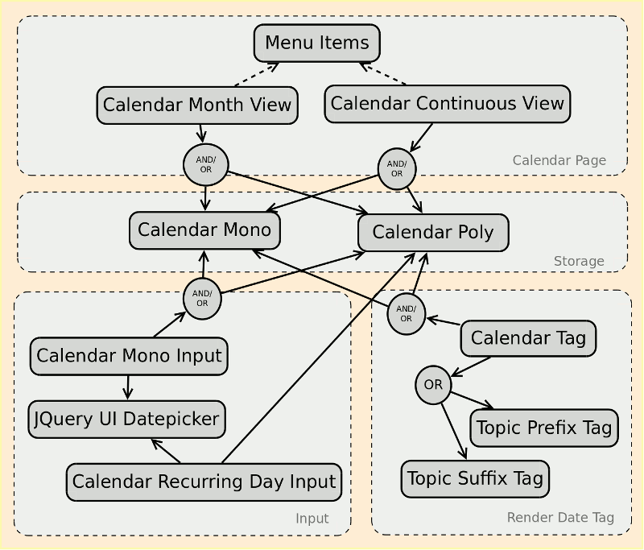

# The marttiphpbb Calendar Extension Set

The Calendar Extension Set is a series of interdependant phpBB extensions that provide together a topic based Calendar. The functionality was split up in multiple phpBB extension for maximum flexibility and maintainability. The Calendar is optimized for multiple day events and does not store time-of-the-day.

The following categories exist:

## Storage

* [Calendar Mono](https://github.com/marttiphpbb/phpbb-ext-calendarmono) for storing a single Calendar event per topic.
* [Calendar Poly](https://github.com/marttiphpbb/phpbb-ext-calendarpoly) (not ready yet) for storing multiple Calendar Events per topic.

## Input

* [Calendar Mono Input](https://github.com/marttiphpbb/phpbb-ext-calendarmonoinput) input for a single Calendar event per topic.
* [Calendar Recurring Day Input](https://github.com/marttiphpbb/phpbb-ext-calendarrecurringdayinput) (not ready yet) input of recurring day calendar events (single days only).

## Tag

* [Calendar Tag](https://github.com/marttiphpbb/phpbb-ext-calendartag) Produces a calendar date tag next to the topic title.

## Visualization

* [Calendar Month View](https://github.com/marttiphpbb/phpbb-ext-calendarmonthview)
* [Calendar Continuous View](https://github.com/marttiphpbb/phpbb-ext-calendarcontinuousview) (not ready yet) A Calendar view to visualize an extended period.

## Archive

* [Calendar Auto Archive](https://github.com/marttiphpbb/phpbb-ext-calendarautoarchive) This extension works together with the [Archive Forum](https://github.com/marttiphpbb/phpbb-ext-archiveforum) extension to move topics automatically to the archive after the Calendar event.

## Helper Extensions

* [Menu Items](https://github.com/marttiphpbb/phpbb-ext-menuitems)
* [JQuery UI Datepicker](https://github.com/marttiphpbb/phpbb-ext-jqueryuidatepicker)
* [Topic Prefix Tags](https://github.com/marttiphpbb/phpbb-ext-topicprefixtags)
* [Topic Suffix Tags](https://github.com/marttiphpbb/phpbb-ext-topicsuffixtags)

## Overview of Interdependencies

